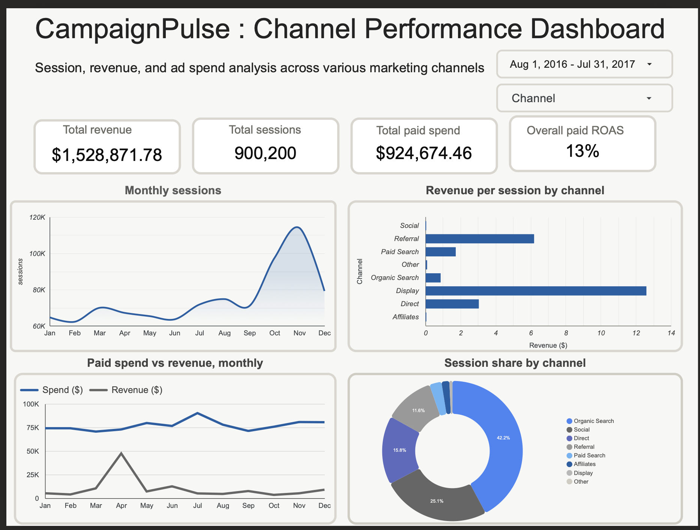

# 📊 CampaignPulse: Marketing Channel Analytics Pipeline

*End to End Pipeline Revealing Which Marketing Channels Drive Revenue*

     

---

## 📑 Table of Contents

- [Business Problem](#-business-problem)
- [Overview](#-overview)
- [Dashboard](#-dashboard)
- [Architecture](#-architecture)
- [Tech Stack](#-tech-stack)
- [Dataset](#-dataset)
- [Pipeline Details](#-pipeline-details)
- [Key Findings](#-key-findings)
- [Dashboard Features](#-dashboard-features)
- [Key Results](#-key-results)
- [Project Structure](#-project-structure)
- [Continuous Integration](#-continuous-integration)
- [Future Scope](#-future-scope)
- [Deployment Note](#-deployment-note)

---

## 🎯 Business Problem

Marketing teams routinely split budget across paid channels (search ads, display) and organic channels (referral, direct, social) without a system that ties spend directly to downstream revenue at the channel level. Without that visibility, an underperforming paid channel can keep burning budget for months before anyone notices, since spend and revenue usually live in separate systems that nobody joins together on a regular cadence.

**Use case:** A marketing analytics or growth team uses this pipeline to answer three questions on an ongoing basis:

1. Which channels are actually driving revenue, and which are just driving traffic?
2. Is our paid ad spend profitable, channel by channel, month by month?

The current dashboard fully answers question 1 and partially answers question 2, it shows the overall paid return on ad spend and a monthly spend versus revenue trend, though it does not yet break that trend out separately for each individual paid channel over time.

This project demonstrates that exact workflow end to end: real session data flows in daily, gets modeled into channel level facts, and surfaces directly in a dashboard a marketing lead could use to make a real budget reallocation decision, in this case, catching that paid channels return only 13 cents per dollar spent while a free channel outperforms them entirely.

---

## 📘 Overview

**CampaignPulse** is an end to end marketing analytics pipeline that ingests a full year of real ecommerce session data, models it through a **Bronze-Silver-Gold medallion architecture** using Airflow and dbt on BigQuery, and surfaces channel level revenue, spend, and ROAS intelligence through an interactive Looker Studio dashboard.

**Key Highlights:**

- 🔄 Orchestrated ELT pipeline with Apache Airflow, TaskGroups, retries, and failure alerting
- 🏗️ Full Bronze-Silver-Gold medallion architecture on BigQuery
- 📅 A full year of real session data, 900,200 sessions across 12 months
- 🔐 Keyless Continuous Integration and Deployment authentication using Workload Identity Federation, no service account keys anywhere
- 📊 Interactive Looker Studio dashboard with date range and channel filters
- 🧬 Slowly Changing Dimension Type 2 tracking via dbt snapshot

---

## 📸 Dashboard

### Channel Performance Overview


**Live dashboard:** https://datastudio.google.com/s/vwW-lkNpJic

---

## 🏗️ Architecture

```
Google Merchandise Store sample dataset (BigQuery public data)
       │
       ▼
 Airflow DAG (Docker, local)
       │
       ▼
Bronze Layer  ──►  ga_sessions_raw, synthetic_ad_spend (partitioned by date)
       │
       ▼
dbt Silver Layer  ──►  stg_ga_sessions, stg_ad_spend, int_sessions_channel
       │
       ▼
dbt Gold Layer  ──►  fct_channel_performance, fct_conversion_funnel
       │
       ▼
Looker Studio Dashboard  ──►  KPI cards, trend charts, channel breakdown
```

---

## 🛠️ Tech Stack

| Layer | Technology |
|---|---|
| Orchestration | Apache Airflow 2.9.3 (Docker Compose) |
| Transformation | dbt Core 1.8.0 + dbt-bigquery |
| Data Warehouse | Google BigQuery |
| Continuous Integration and Deployment | GitHub Actions + Workload Identity Federation |
| Visualization | Looker Studio |
| Containerization | Docker |

---

## 📦 Dataset

- **Source:** [Google Analytics Sample dataset](https://www.kaggle.com/datasets/bigquery/google-analytics-sample) — `bigquery-public-data.google_analytics_sample.ga_sessions_*`, a Universal Analytics export in BigQuery public data
- **Size:** 900,200 sessions across a full year, 2016-08-01 through 2017-08-01
- **Channels:** Organic Search, Direct, Referral, Paid Search, Social, Display, Affiliates
- **Key Fields:** Native `channelGrouping` taxonomy, nested `hits` array for ecommerce funnel events, `totals.transactionRevenue`

> Ad spend is not part of this public dataset. A synthetic daily spend table is generated for the genuinely paid channels (Paid Search, Display) via `scripts/synthetic_spend_generator.py`, clearly labeled as synthetic, and used only to power the CAC and ROAS metrics downstream.

---

## ⚙️ Pipeline Details

### Bronze Layer
- The BigQueryInsertJobOperator in Airflow extracts the full year of session data directly from the public dataset
- Written to a project owned Bronze dataset, partitioned by date, fully truncated and reloaded each run
- 900,200 raw session rows landed, including nested ecommerce hit detail

### Silver Layer
- Flattens session level data, unnesting the `hits` array via correlated subqueries to derive funnel event counts
- Deduplicates sessions using `qualify row_number()`, since a small number of sessions span midnight and appear twice across adjacent daily shards
- Maps the native `channelGrouping` field directly, rather than hand rolled source and medium pattern matching

### Gold Layer
- Channel level daily sessions, revenue, spend, cost per acquisition, and return on ad spend
- Full funnel conversion rates from item view through purchase, by channel
- All Gold models are full table rebuilds rather than incremental, since Bronze is fully truncated and reloaded every run, there is no meaningful "new since last run" slice to merge

---

## 🔎 Key Findings

Across the full year of data:

| Finding | Value |
|---|---|
| Total paid spend (Paid Search + Display) | $924,674.46 |
| Overall paid ROAS | 13% |
| Referral revenue, at zero spend (approximate) | ~$644,800 |
| Peak monthly sessions (holiday season) | 113,907 (November) |

Paid channels returned just 13 cents for every dollar spent, while Referral traffic, which costs nothing, generated revenue on a similar scale to both paid channels combined.

---

## 📊 Dashboard Features

**Filters**
- Date range control spanning the full year
- Channel filter with multi select

**KPI Cards**
- Total revenue, total sessions, total paid spend, overall paid ROAS

**Charts**
- Monthly sessions trend, with a clear holiday season spike
- Revenue per session by channel, horizontal bar
- Paid spend versus revenue, trended monthly
- Session share by channel, donut chart

---

## 📈 Key Results

| Metric | Value |
|---|---|
| Total Sessions | 900,200 |
| Total Revenue | $1,528,871.78 |
| Total Paid Spend | $924,674.46 |
| Overall Paid ROAS | 13% |
| Top Revenue per Session Channel | Display ($12.59) |
| Top Volume Channel | Organic Search (42.2% of sessions) |

---

## 📂 Project Structure

```
campaignpulse/
├── dags/
│   ├── campaignpulse_elt_dag.py
│   └── sql/load_ga_sessions_bronze.sql
├── dbt/
│   ├── models/staging/
│   ├── models/intermediate/
│   ├── models/marts/
│   ├── snapshots/
│   └── seeds/
├── scripts/
│   └── synthetic_spend_generator.py
├── assets/
│   └── dashboard.png
├── .github/workflows/dbt_ci.yml
├── docker-compose.yaml
└── Dockerfile.airflow
```

---

## 🔐 Continuous Integration

Every pull request that touches the `dbt/` folder runs `dbt seed`, `dbt run`, and `dbt test` against a dedicated CI dataset in GitHub Actions. Authentication uses **Workload Identity Federation**, not a downloaded service account key, GitHub Actions proves its identity directly to Google Cloud through a short lived token exchange scoped to this specific repository, with no long lived credential ever stored as a secret.

---

## 🔭 Future Scope

- Add a conversion funnel visualization (view → cart → checkout → purchase) to the dashboard using the existing `fct_conversion_funnel` table, which is built and tested in the pipeline but not yet surfaced visually
- Extend the synthetic ad spend model with campaign level granularity, not just channel level
- Add anomaly detection on daily spend versus revenue to auto flag underperforming days

---

## 📌 Deployment Note

CampaignPulse is designed as a fully self contained, locally orchestrated pipeline. Airflow, dbt, and the BigQuery connection all run within Docker on the local machine, authenticated via Application Default Credentials rather than a downloaded key file.

To run the project, clone the repository, authenticate with `gcloud auth application-default login`, and start the stack with `docker compose up airflow-init && docker compose up`. Once running, Airflow is accessible at `localhost:8080`.

---

*Built with Airflow · dbt Core · Google BigQuery · Docker · GitHub Actions · Workload Identity Federation · Looker Studio*
